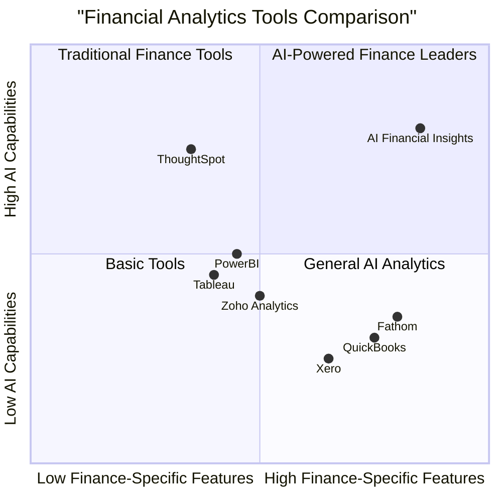

# Product Requirements Document: AI Financial Insights App

## 1. Document Information

- **Project Name:** AI Financial Insights
- **Document Owner:** Emma, Product Manager
- **Date:** May 29, 2025
- **Version:** 1.0

## 2. Original Requirements

Create an AI-powered financial insights application for SMBs that enables:
- File upload (.xlsx, .csv, QuickBooks exports) and data cleaning with pandas
- Automated dashboards using Streamlit/Plotly (revenue trends, expense breakdown, cash flow projections, profitability metrics)
- AI-powered recommendations to identify anomalies
- Text-to-SQL functionality for financial Q&A
- Text-to-visualization capabilities

Application should support tiered monetization:
- Free tier: Upload, basic charts, 3 queries/month
- Pro tier ($19/mo): Unlimited queries, AI recommendations
- Business tier ($99/mo): Forecasting, budget planning, multi-user, API access

Technology stack includes:
- Backend: Python (FastAPI)
- AI: OpenAI/LLM integration
- Data: Pandas+DuckDB
- Frontend: Streamlit/Dash
- Visualization: Plotly/Matplotlib
- Auth & Billing: Firebase/Stripe

## 3. Product Definition

### 3.1 Product Goals

1. **Democratize Financial Analysis:** Provide SMBs with enterprise-grade financial analysis tools that were previously accessible only to larger businesses with dedicated finance teams.

2. **Simplify Data-Driven Decision Making:** Enable business owners and managers to leverage their financial data through intuitive interfaces without requiring technical expertise.

3. **Automate Financial Insights:** Reduce the time and expertise needed to identify business opportunities, risks, and optimization areas through AI-powered recommendations.

### 3.2 User Stories

1. **As a small business owner**, I want to upload my QuickBooks export so that I can visualize my business performance without manually creating reports.

2. **As a financial manager**, I want to ask natural language questions about our financial data so that I can get quick answers without writing SQL queries or creating spreadsheet formulas.

3. **As a business analyst**, I want to get AI-generated recommendations based on our financial data so that I can identify potential issues before they become major problems.

4. **As a CFO of a medium business**, I want to create budget plans and forecasts based on historical data so that I can make more accurate financial projections.

5. **As a business consultant**, I want to generate custom visualizations through natural language requests so that I can present insights to clients without manual chart creation.

### 3.3 Competitive Analysis

| Competitor | Description | Pros | Cons |
|------------|-------------|------|------|
| **QuickBooks** | Industry-standard accounting software | • Comprehensive accounting tools<br>• Extensive integration ecosystem<br>• Brand recognition | • Limited data visualization<br>• Minimal AI capabilities<br>• High learning curve<br>• Not focused on insights |
| **Xero** | Cloud accounting platform | • Modern interface<br>• Good reporting<br>• Multi-user support | • Basic visualizations<br>• Limited natural language capabilities<br>• Primarily accounting-focused |
| **Tableau** | Business intelligence platform | • Powerful visualizations<br>• Extensive customization<br>• Enterprise-grade | • Expensive<br>• High learning curve<br>• Limited AI integration<br>• Not finance-specific |
| **PowerBI** | Microsoft's data visualization tool | • Integration with Excel<br>• Robust visualization<br>• Widespread adoption | • Complex for beginners<br>• Limited natural language query<br>• Not finance-specific |
| **Fathom** | Financial reporting & analysis | • Finance-specific<br>• KPI tracking<br>• Multiple-entity support | • Limited AI capabilities<br>• No natural language querying<br>• Relatively expensive |
| **Zoho Analytics** | Business intelligence and analytics | • User-friendly<br>• Good data visualization<br>• Integration with Zoho ecosystem | • Limited AI recommendations<br>• Basic natural language processing<br>• Not finance-specific |
| **ThoughtSpot** | AI-powered analytics platform | • Strong natural language capabilities<br>• Modern interface<br>• Good visualizations | • Enterprise pricing<br>• Not finance-specific<br>• Limited forecasting capabilities |

### 3.4 Competitive Quadrant Chart



## 4. Technical Specifications

### 4.1 Requirements Analysis

The AI Financial Insights App requires several key technical components:

1. **Data Ingestion & Processing:**
   - File upload system supporting .xlsx, .csv files
   - QuickBooks integration via API or export uploads
   - Pandas-based data cleaning and transformation
   - DuckDB for in-memory SQL storage and querying

2. **Analytics & Visualization:**
   - Streamlit or Plotly Dash for dashboard interface
   - Plotly/Matplotlib for chart generation
   - Automated dashboard generation based on data types
   - Custom visualization based on natural language requests

3. **AI & Machine Learning:**
   - OpenAI/LLM integration for natural language processing
   - Text-to-SQL conversion for financial queries
   - Anomaly detection algorithms for identifying unusual patterns
   - Forecasting models for business planning

4. **Authentication & Authorization:**
   - Firebase or custom auth system for user management
   - Role-based access control for multi-user functionality
   - Secure data isolation between tenants

5. **Billing & Subscription:**
   - Stripe integration for subscription management
   - Usage tracking for tier limitations
   - Upgrade/downgrade flows

### 4.2 Requirements Pool

#### P0 (Must Have)

1. File upload functionality (.xlsx, .csv) with data validation
2. Data cleaning and transformation using pandas
3. In-memory database storage using DuckDB
4. Basic financial dashboard generation (revenue, expenses, profit)
5. Simple text-to-SQL for basic financial queries
6. User authentication and data isolation
7. Tiered subscription model with Stripe integration

#### P1 (Should Have)

1. QuickBooks integration via export or API
2. Advanced dashboards (cash flow, profitability metrics)
3. Enhanced text-to-SQL with financial context
4. AI-driven anomaly detection and insights
5. Text-to-visualization feature for custom charts
6. User data persistence and history
7. Dashboard sharing functionality

#### P2 (Nice to Have)

1. Forecasting and predictive analytics
2. Multi-user access with role-based permissions
3. Budget planning and scenario modeling
4. API access for data integration
5. White-labeling for accounting firms
6. Advanced LLM-powered financial advisor
7. Mobile-responsive design for on-the-go access

### 4.3 UI Design Draft

**Main Dashboard Layout:**

```
+--------------------------------------------------------------+
|  LOGO   [User Profile]     [Upgrade]     [Settings]           |
+--------------------------------------------------------------+
|                                                              |
|  [Upload Financial Data]     [Connect QuickBooks]            |
|                                                              |
+--------------------------------------------------------------+
|                                                              |
|  FINANCIAL OVERVIEW                                          |
|                                                              |
|  +--------------------+  +--------------------+             |
|  | Revenue Trend      |  | Expense Breakdown  |             |
|  | [Line Chart]       |  | [Pie Chart]        |             |
|  +--------------------+  +--------------------+             |
|                                                              |
|  +--------------------+  +--------------------+             |
|  | Cash Flow          |  | Profitability      |             |
|  | [Bar Chart]        |  | [KPI Indicators]   |             |
|  +--------------------+  +--------------------+             |
|                                                              |
+--------------------------------------------------------------+
|                                                              |
|  AI INSIGHTS                                                 |
|  +----------------------------------------------------------+ |
|  | • Revenue is up 15% from last month                      | |
|  | • Unusual expense increase in Marketing category         | |
|  | • Cash reserves trending downward over past quarter      | |
|  +----------------------------------------------------------+ |
|                                                              |
+--------------------------------------------------------------+
|                                                              |
|  ASK YOUR DATA                                               |
|  +----------------------------------------------------------+ |
|  | [What was our profit margin last quarter?            ]   | |
|  +----------------------------------------------------------+ |
|                                                              |
|  +----------------------------------------------------------+ |
|  | Profit margin for Q1 2025 was 23.4%, which represents a  | |
|  | 2.1% increase from Q4 2024 (21.3%).                      | |
|  | [Show visualization]                                     | |
|  +----------------------------------------------------------+ |
|                                                              |
+--------------------------------------------------------------+
```

### 4.4 Open Questions

1. **Data Security & Compliance:** What additional measures should be implemented for financial data security and regulatory compliance (GDPR, CCPA, etc.)?

2. **Integration Limitations:** What are the limitations of QuickBooks API integration and how should we handle authentication refreshes?

3. **LLM Reliability:** How do we ensure the accuracy of AI-generated insights and prevent hallucinations or incorrect financial advice?

4. **Performance Optimization:** What strategies should be employed for handling large financial datasets in DuckDB and maintaining responsiveness?

5. **Multi-currency Support:** Should the initial version support multiple currencies and exchange rate conversions?

## 5. Technical Architecture

### 5.1 System Architecture

```
+-------------------+      +--------------------+
|                   |      |                    |
|  Frontend         |      |  Backend           |
|  (Streamlit)      +----->+  (FastAPI)         |
|                   |      |                    |
+--------+----------+      +----+---------------+
         ^                      |
         |                      v
         |               +------+--------------+
         |               |                     |
         |               |  AI Services        |
         |               |  (OpenAI/LLM)       |
         |               |                     |
         |               +------+--------------+
         |                      |
         |                      v
+--------+----------+    +------+--------------+
|                   |    |                     |
|  Visualization    |    |  Data Processing    |
|  (Plotly)         |<---+  (Pandas+DuckDB)    |
|                   |    |                     |
+-------------------+    +---------------------+
```

### 5.2 Data Flow

1. **User uploads financial data** through the frontend interface
2. **Backend processes and cleans the data** using pandas
3. **Data is stored** in DuckDB in-memory database
4. **Automated dashboards are generated** based on detected data types
5. **User interacts with data** through natural language or UI
6. **AI services interpret queries** and generate SQL or visualization code
7. **Results are displayed** to the user through the frontend

## 6. Monetization Strategy

### 6.1 Pricing Tiers

#### Free Tier
- Upload and process up to 3 financial files per month
- Access to basic dashboards (revenue, expenses, profit)
- Limited to 3 natural language queries per month
- Single user access
- Data retention for 30 days

#### Pro Tier ($19/month or $190/year)
- Unlimited file uploads and processing
- Access to all standard dashboards
- Unlimited natural language queries
- AI-powered recommendations and insights
- Data retention for 1 year
- Email exports and scheduled reports
- Single user access

#### Business Tier ($99/month or $990/year)
- All Pro features
- Forecasting and predictive analytics
- Budget planning and scenario modeling
- Multi-user access (up to 5 users)
- API access for data integration
- Data retention for 3 years
- Priority support

### 6.2 Growth Strategy

1. **Initial Market Penetration:**
   - Focus on freelancers and small businesses with free tier
   - Leverage network effect through financial report sharing

2. **Conversion Optimization:**
   - Strategic feature gating to encourage upgrades
   - Usage-based prompts when approaching free tier limits

3. **Expansion Opportunities:**
   - Industry-specific financial templates and benchmarking
   - White-label solution for accounting firms
   - Enterprise solution for larger organizations

## 7. Implementation Roadmap

### 7.1 Phase 1: MVP (Months 1-2)
- Basic file upload (.xlsx, .csv)
- Data processing with pandas
- Simple dashboard generation
- User authentication
- Basic text-to-SQL functionality
- Free tier implementation

### 7.2 Phase 2: Core Features (Months 3-4)
- QuickBooks integration
- Advanced dashboards
- Enhanced text-to-SQL with financial context
- Basic AI insights
- Stripe billing integration
- Pro tier implementation

### 7.3 Phase 3: Advanced Features (Months 5-6)
- Text-to-visualization functionality
- Advanced AI recommendations
- Forecasting capabilities
- Multi-user support
- API access
- Business tier implementation

## 8. Success Metrics

### 8.1 User Metrics
- Monthly Active Users (MAU)
- Conversion rate from free to paid tiers
- User retention rate after 30/60/90 days
- Feature usage breakdown
- Query volume and success rate

### 8.2 Business Metrics
- Monthly Recurring Revenue (MRR)
- Customer Acquisition Cost (CAC)
- Customer Lifetime Value (LTV)
- Churn rate by tier
- Expansion revenue from tier upgrades

### 8.3 Product Metrics
- Dashboard generation time
- Query response time
- AI insight accuracy
- Data processing success rate
- Support ticket volume

## 9. Risks and Mitigations

| Risk | Impact | Likelihood | Mitigation |
|------|--------|------------|------------|
| **Data Security Breach** | High | Low | Implement encryption at rest and in transit; regular security audits; compliance with financial data regulations |
| **AI Recommendation Inaccuracy** | Medium | Medium | Implement confidence scores; human-in-the-loop verification for critical insights; clear disclaimers |
| **Performance Issues with Large Datasets** | Medium | Medium | Implement pagination; optimize DuckDB queries; consider data sampling for previews |
| **User Adoption Challenges** | High | Medium | Intuitive UI design; interactive onboarding; template library; knowledge base and tutorials |
| **Integration Failures** | Medium | Low | Comprehensive testing with various file formats; graceful error handling; clear import guidelines |

## 10. Conclusion

The AI Financial Insights App addresses a critical need for SMBs by democratizing access to advanced financial analytics tools that were previously available only to enterprises with dedicated resources. By leveraging modern AI capabilities, the application will empower business owners and financial managers to make data-driven decisions without requiring technical expertise.

The tiered pricing model ensures accessibility for businesses of all sizes while providing a clear upgrade path as their needs grow. The phased implementation approach allows for rapid market entry with an MVP while methodically building toward the full feature set.

By focusing on intuitive design, powerful AI capabilities, and seamless data processing, the AI Financial Insights App has the potential to transform how SMBs understand and leverage their financial data.